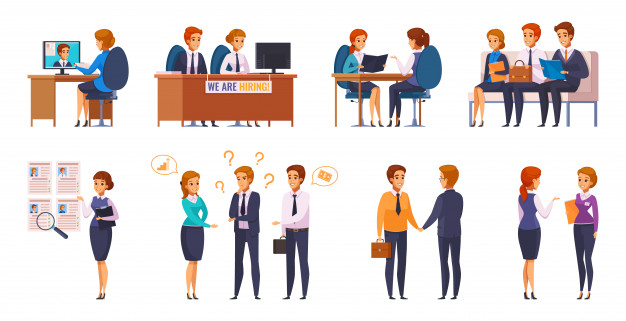

   

# Reducao_Turnover_RH_Machine_Learning

Com o imenso volume de dados sendo criado atualmente, é vital que as empresas saibam coletar e utilizar dados que possam dar a elas vantagens competitivas no mercado.

Além de casos mais comuns como [Sistemas de Recomendação]('https://www.ilumeo.com.br/todos-posts/2019/08/12/como-funcionam-os-sistemas-de-recomendacao'), outras áreas e outros tipos de empresas também podem se beneficiar da Ciência de Dados.

  

> O objetivo deste projeto é analisar e buscar soluções para diminuir o **Turnover**, e aumentar a retenção de bons profissionais nas empresas.

Utilizando dados disponibilizados no [Kaggle]('https://kaggle.com/'), construiremos um modelo de Machine Learning capaz de nos ajudar a prever possíveis atritos, que podem ajudar empresas a tomarem decisões afim de minimizar esses efeitos, aumentar a qualidade de vida no ambiente de trabalho, e reter os bons profissionais da empresa.

  

